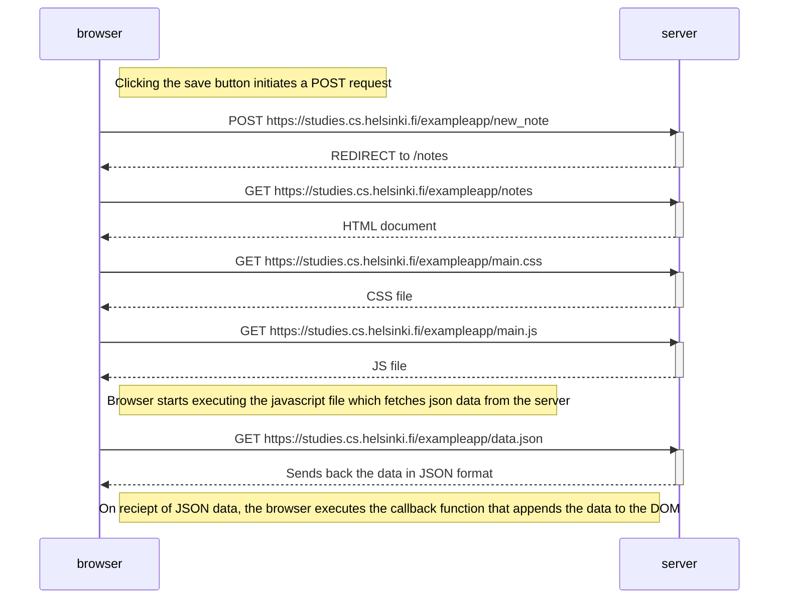

```mermaid
sequenceDiagram
participant browser
participant server

    Note right of browser: Clicking the save button initiates a POST request

    browser ->> server: POST https://studies.cs.helsinki.fi/exampleapp/new_note
    activate server
    server -->> browser: REDIRECT to /notes
    deactivate server

    browser ->> server : GET https://studies.cs.helsinki.fi/exampleapp/notes
    activate server
    server -->> browser: HTML document
    deactivate server

    browser ->> server : GET https://studies.cs.helsinki.fi/exampleapp/main.css
    activate server
    server -->> browser: CSS file
    deactivate server

    browser ->> server : GET https://studies.cs.helsinki.fi/exampleapp/main.js
    activate server
    server -->> browser: JS file
    deactivate server

    Note right of browser: Browser starts executing the javascript file which fetches json data from the server

    browser ->> server : GET https://studies.cs.helsinki.fi/exampleapp/data.json
    activate server
    server -->> browser: Sends back the data in JSON format
    deactivate server
    
    Note right of browser: On reciept of JSON data, the browser executes the callback function that appends the data to the DOM
```