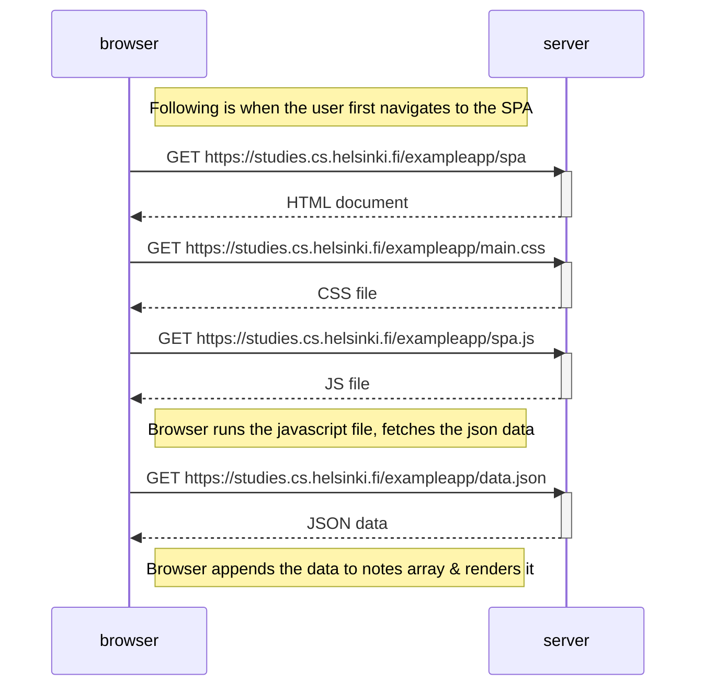

```mermaid
sequenceDiagram
participant browser
participant server

    Note right of browser: Following is when the user first navigates to the SPA
    browser ->> server: GET https://studies.cs.helsinki.fi/exampleapp/spa
    activate server
    server -->> browser: HTML document
    deactivate server

    browser ->> server: GET https://studies.cs.helsinki.fi/exampleapp/main.css
    activate server
    server -->> browser: CSS file
    deactivate server

    browser ->> server: GET https://studies.cs.helsinki.fi/exampleapp/spa.js
    activate server
    server -->> browser: JS file
    deactivate server

    Note right of browser: Browser runs the javascript file, fetches the json data
    browser ->> server: GET https://studies.cs.helsinki.fi/exampleapp/data.json
    activate server
    server -->> browser: JSON data
    deactivate server

     Note right of browser: Browser appends the data to notes array & renders it
```