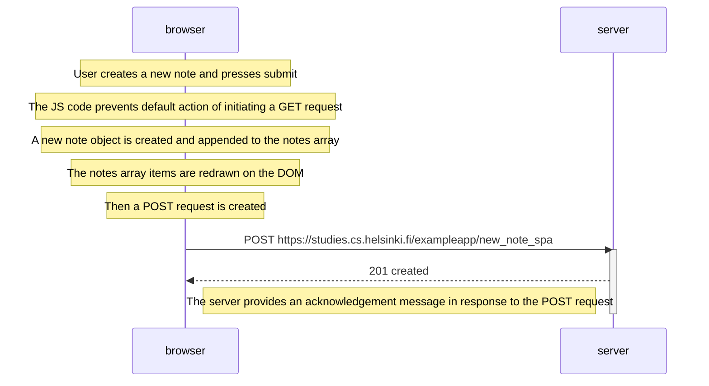

```mermaid
sequenceDiagram
participant browser
participant server

    Note over browser: User creates a new note and presses submit
    Note over browser: The JS code prevents default action of initiating a GET request
    Note over browser:  A new note object is created and appended to the notes array 
    Note over browser: The notes array items are redrawn on the DOM
    Note over browser: Then a POST request is created
    browser ->> server: POST https://studies.cs.helsinki.fi/exampleapp/new_note_spa
    activate server
    server -->> browser: 201 created
    Note left of server: The server provides an acknowledgement message in response to the POST request
    deactivate server

```